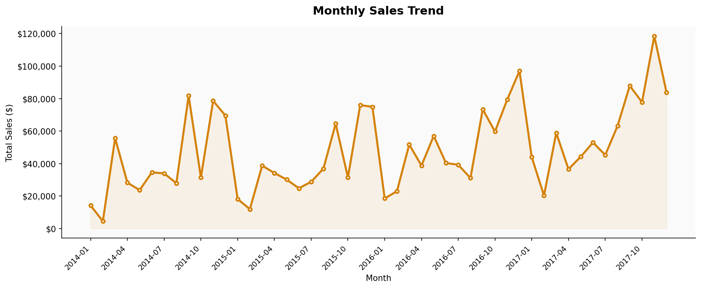

# 📊 Retail Sales Data Analysis

## 📌 Objective
Analyze retail sales data to identify trends, top-performing products, and business insights.

## 🛠 Tools Used
- Python
- Pandas
- Matplotlib

## 📁 Dataset
- Source: (Kaggle / sample dataset / etc.)
- Records: (approx number if you know it)
- Features: Date, Product, Region, Revenue, etc.
  
## 🔍 Key Insights
- Sales increased significantly in Q4, likely driven by holiday demand and promotions
- A small group of products generated the majority of revenue (high-performing SKUs)
- Certain regions underperformed, indicating potential opportunities for targeted marketing or expansion

## 📊 What I Did
- Cleaned and prepared raw data
- Performed exploratory data analysis (EDA)
- Created visualizations to understand trends

## 📷 Visualizations

## 💡 Business Recommendations
- Focus marketing efforts on top-performing products to maximize revenue
- Investigate low-performing regions and adjust pricing or promotions
- Prepare inventory ahead of Q4 to meet increased demand
